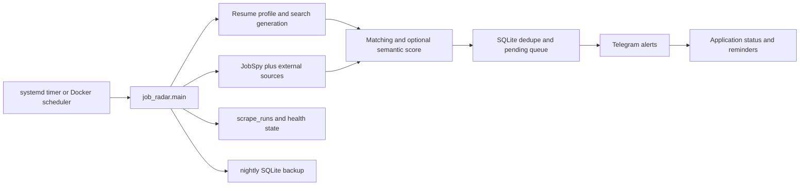

# Job Radar Technical Reference

Job Radar is a Python 3.10+ scheduled job-discovery pipeline. It builds
resume-aligned searches, gathers listings from multiple providers, ranks and
deduplicates them, sends Telegram alerts, and tracks applications in SQLite.

## Runtime flow

```text
resume PDFs
  -> cached role and skill profile
  -> rotating JobSpy searches
  -> scheduled external source adapters
  -> deterministic and optional semantic scoring
  -> URL-aware deduplication
  -> ranked Telegram notifications
  -> application follow-up tracking
  -> run history
```

The process runs to completion every 30 minutes under systemd or the Docker
scheduler. A filesystem lock prevents scheduled and manual runs from
overlapping.



## Project structure

```text
main.py                 orchestration and CLI
scraper.py              isolated JobSpy provider calls
sources/                HN, Cutshort, and Hirist adapters
scrape_state.py         provider cooldowns, rotation, and run history
backup.py               consistent SQLite backup and retention CLI
resume_profile.py       PDF hashing, extraction, and profile cache
search_generator.py     resume-derived search generation
matcher.py              deterministic relevance and eligibility rules
semantic.py             optional borderline embedding score
dedupe.py               job identity, delivery state, and feedback
application_tracker.py  Telegram commands and follow-up reminders
notifier.py             Telegram Bot API transport and formatting
run_lock.py             single-instance protection
scheduler.py            Docker scrape and backup loop
web/                    localhost report UI and trigger API
config.yaml             runtime settings and search definitions
deploy/                 scraper, UI, and nightly backup units/timers
tests/                  offline unit and integration tests
data/jobs.db            SQLite state, excluded from Git
data/backups/           timestamped SQLite backups, excluded from Git
```

Docker deployment uses `Dockerfile` and `docker-compose.yml`. The scheduler
and UI containers share the `data/` and read-only `resumes/` mounts.
`JOB_RADAR_RESUME_PATHS` overrides the host-specific resume paths in
`config.yaml` for the container filesystem.

## Job sources

JobSpy providers are called independently so one provider failure does not
discard results from another. Indeed searches require `country_indeed` and
must not combine `hours_old` with both `job_type` and `is_remote`.

External adapters feed the same DataFrame and matching pipeline:

- HN Who's Hiring: at most every 12 hours.
- Cutshort: at most every 6 hours.
- Hirist: at most every 6 hours.

Source attempt times, results, errors, and HTTP 429 cooldowns are persisted.

## Matching

The deterministic matcher evaluates:

- resume roles and skills;
- excluded and seniority-heavy titles;
- required experience;
- remote status and country eligibility;
- stored relevance feedback.

Remote listings with explicit region restrictions are checked against
`matching.allowed_countries`. Optional semantic scoring applies only to
borderline jobs and adds a bounded bonus.

## Job identity and delivery

The primary identity is `sha256(normalized_job_url)`. Tracking parameters and
URL fragments are removed. Listings without a URL fall back to
`sha256(title + company + site)`.

Older title/company/site identities migrate lazily when the stored URL matches.
Associated feedback and application records migrate with the job ID. Telegram
payloads remain pending until the API accepts them, and undelivered jobs expire
after the configured retention period.

## SQLite state

`data/jobs.db` contains:

- `seen_jobs`: identity, notification payload, delivery, and expiry;
- `job_feedback`: relevant, irrelevant, and applied labels;
- `applications`: application date, status, contact, notes, follow-up/interview
  dates, document versions, and the application-time description snapshot;
- `feedback_events`: append-only relevance history;
- `application_events`: append-only application transition history;
- `dedupe_events`: duplicate detections used by metrics;
- `audit_log`: UI mutation records;
- `schema_version`: migration version;
- `provider_state`: result state, rate-limit cooldowns, and zero-result streaks;
- `runtime_state`: search/source cursors, Telegram offset, and reminders;
- `scrape_runs`: timing, provider outcomes, counts, errors, and health alerts.

## Telegram

Credentials come only from:

```text
TELEGRAM_BOT_TOKEN
TELEGRAM_CHAT_ID
```

Each job message includes a 12-character ID. Supported commands are:

```text
/applied <id>
/contacted <id>
/status <id> <applied|screening|interview|offer|rejected|withdrawn>
```

Job alerts also expose inline buttons for `Apply`, `Save`, `Reject`, `Show fewer
like this`, `Contacted`, and `Open job`. Button presses use the same SQLite-backed
feedback and application paths as the commands above.

Commands are accepted only from `TELEGRAM_CHAT_ID`. The persisted Bot API
offset prevents replay after restarts. Active applications with no contact for
the configured number of days appear in one daily reminder; terminal statuses
are excluded.

## Monitoring and failure handling

- Provider and external-source failures are isolated.
- HTTP 429 responses create persisted exponential cooldowns.
- A successful provider prevents an all-provider failure classification.
- A Telegram health alert is sent once per sustained outage streak.
- A separate Telegram alert is sent once per provider failure streak, even
  while other providers continue returning jobs.
- Repeated successful zero-result runs are reported as provider degradation.
- Application command and reminder errors do not stop scraping.
- Telegram delivery is marked complete only after API acceptance.

## Execution modes

```bash
python -m job_radar.main
python -m job_radar.main --dry-run
python -m job_radar.main --explain
python -m job_radar.main --feedback <job_id> <relevant|irrelevant|applied>
python -m job_radar.web.server
```

Dry-run and explain mode perform scraping and matching without Telegram calls
or SQLite state changes.

The local UI binds to 127.0.0.1:8765 by default. Its Dashboard, Jobs,
Applications, and History tabs read the existing SQLite tables. Jobs can be
searched, filtered, sorted, paginated, opened for full details,
activated/deactivated, and moved through application statuses. Optional API
authentication uses `JOB_RADAR_UI_TOKEN`; cross-origin mutations are rejected,
trigger requests are rate limited, and every mutation is recorded in
`audit_log`. `/health` and `/api/metrics` support local monitoring.

The nightly backup unit writes timestamped SQLite copies to `data/backups` and
retains the configured number of days. Monitoring tracks each provider's
failure streak separately from the all-provider outage streak, so a provider
can trigger a Telegram degradation alert even while other sources succeed.

## Scheduling

`deploy/job-radar.timer` runs at minute `00` and `30`:

```ini
OnCalendar=*-*-* *:00/30:00
Persistent=true
```

The service uses the project directory, its virtual-environment Python
executable, and the project `.env` file.
