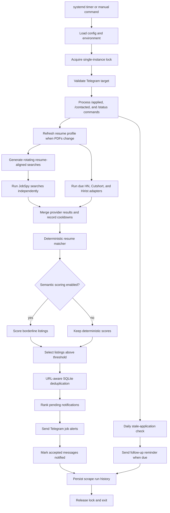

# Job Radar

Job Radar is a Python 3.10+ automation that builds searches from the latest
resume, scrapes JobSpy providers independently, ranks listings, deduplicates
them in SQLite, and sends the strongest new matches through Telegram. It runs
to completion every 30 minutes under systemd. A small localhost-only UI is
available for reports and manual triggers; there is no application framework,
queue, or Google Sheets integration.

## Runtime flow

```text
resume PDFs
  -> cached roles and skills
  -> rotating resume-generated JobSpy searches
  -> scheduled HN, Cutshort, and Hirist source adapters
  -> per-provider scrape, cooldown, and health status
  -> deterministic exclusions and relevance score
  -> optional semantic score for borderline jobs
  -> normalized-URL dedupe with legacy-ID migration
  -> ranked pending queue with seven-day expiry
  -> one Telegram message per job
  -> scrape_runs audit record
```

A process lock at `data/job-radar.lock` prevents a manual invocation from
overlapping a systemd run.

## Repository layout

```text
Radar/
├── job_radar/                 Python package
│   ├── main.py                CLI and orchestration
│   ├── web/                   standard-library report UI
│   ├── scraper.py             JobSpy provider isolation
│   ├── sources/               HN, Cutshort, and Hirist adapters
│   ├── matcher.py             resume relevance rules
│   ├── resume_profile.py      PDF extraction and profile cache
│   ├── search_generator.py    resume-derived search terms
│   ├── dedupe.py              SQLite identity and delivery state
│   ├── application_tracker.py Telegram commands and reminders
│   ├── notifier.py            Telegram Bot API transport
│   ├── scrape_state.py        cooldowns, rotation, and run history
│   ├── scheduler.py            Docker scrape and backup loop
│   ├── backup.py               SQLite backup and retention CLI
│   └── semantic.py             optional borderline scoring
├── tests/                     offline test suite and fixtures
├── deploy/                    systemd service and timer
├── Dockerfile                 Docker image definition
├── docker-compose.yml         scheduler and UI services
├── .env.example               credentials and Docker defaults template
├── data/                      runtime SQLite and resume cache
├── config.yaml                searches and runtime settings
├── requirements.txt           Python dependencies
├── README.md                  setup and operations guide
└── PROJECT.md                current technical reference
```

## End-to-end flow



Dry-run follows the same scrape and matching branches but skips Telegram
validation, command polling, reminders, search-state writes, deduplication
writes, and run-history writes.

## Setup

Create a virtual environment and install the pinned project dependencies:

```bash
python3 -m venv .venv
. .venv/bin/activate
pip install -U -r requirements.txt
```

Create `.env` in the project root:

```bash
TELEGRAM_BOT_TOKEN=123456789:your_complete_botfather_token
TELEGRAM_CHAT_ID=your_personal_chat_id
```

Send `/start` to the bot before the first run. `.env` is ignored by Git.

## Local UI

The UI is a localhost-only, standard-library report page. Use the four tabs to
navigate between Dashboard, Jobs, Applications, and History:

- **Dashboard** gives the current counts, five most recent jobs, and the latest
  run summary.
- **Jobs** supports title/company search, job-state and application-state
  filters, sorting by newest/match/company, pagination, and a details dialog.
  Each row can be activated/deactivated, marked applied, moved through
  `screening`, `interview`, `offer`, `rejected`, or `withdrawn`, and marked as
  contacted.
- **Applications** shows tracked applications and highlights follow-ups due
  after seven days without contact.
- **History** shows scraper runs and every manual UI trigger, including errors.

Start it from the repository root:

```bash
python -m job_radar.web.server
```

Open http://127.0.0.1:8765. The UI binds to localhost and has no
authentication, so do not expose the port publicly. Restart the web service
after updating the code so the browser loads the new page.

## Resume automation and search generation

`resume.paths` in `config.yaml` lists the PDF files Job Radar watches. Every run
hashes those files. If either changes, `data/resume_profile.json` is rebuilt
automatically with the newly detected roles and skills.

When `dynamic_searches.enabled` is `true`, up to
`dynamic_searches.role_limit` rotating LinkedIn/Google queries are generated
from that current profile. The always-run Indeed query is also refreshed with
the strongest detected backend skills. Static non-always entries under
`searches` are fallbacks for `dynamic_searches.enabled: false`.

Indeed entries continue to obey JobSpy's constraint: they include
`country_indeed` and do not combine `hours_old` with both `job_type` and
`is_remote`.

## Additional high-signal sources

Job Radar also ingests three sources that are not supported by JobSpy:

- **HN Who's Hiring:** locates the newest monthly thread through the public
  HN Algolia search and reads top-level company posts through the
  [official Hacker News API](https://github.com/HackerNews/API). Remote posts
  explicitly restricted to the US, Canada, Europe, or the Americas are
  rejected by the existing country filter.
- **Cutshort:** reads bounded backend, API, Python, Go, and machine-learning
  search pages. Public job cards provide the title, company, experience,
  location, salary, description, and stable application URL.
- **Hirist:** reads the public backend and AI/ML category feeds used by
  Hirist's own job pages. Skills and minimum experience are converted into
  the same fields consumed by the resume matcher.

These adapters require no account credentials. They run independently, so a
failure cannot discard JobSpy or another source's results. Cutshort and Hirist
run at most every six hours; HN runs every twelve hours. Attempt times,
results, errors, and rate-limit cooldowns are stored in the same SQLite state
and `scrape_runs` history as JobSpy providers.

## Dry run

```bash
python -m job_radar.main --dry-run
```

`--explain` is an alias. The diagnostic run performs resume refresh, query
selection, scraping, and matching without:

- validate or call Telegram;
- advance the search rotation cursor;
- update cooldowns, dedupe rows, feedback, or run history in SQLite;
- send notifications.

For every scraped listing it prints the short job ID, score, score reasons,
exclusion reason, detected required experience, country decision, and whether
the listing is already seen.

## Normal run

From WSL/Linux, export `.env` and run:

```bash
set -a
. ./.env
set +a
python -m job_radar.main
```

A normal run validates Telegram before scraping, records provider outcomes,
stores new matched jobs, expires stale pending jobs, sends at most
`matching.max_alerts_per_run`, and writes final counts to `scrape_runs`.

The summary fields are:

- `scraped`: listings returned by successful providers;
- `matched`: listings that passed deterministic and optional semantic scoring;
- `new`: matched listings newly stored;
- `pending`: all non-expired, undelivered notifications;
- `queued`: notifications selected for this run;
- `deferred`: notifications retained for a later run;
- `expired`: old pending notifications retired this run;
- `sent`: messages Telegram accepted.

## Matching and feedback

Deterministic matching evaluates role, resume skills, title exclusions,
seniority, required years, remote status, and country. `config.yaml` controls
the threshold and exclusions.

Telegram messages contain a short ID:

```text
🆔 1a2b3c4d5e6f
```

Use that ID to label the result:

```bash
python -m job_radar.main --feedback 1a2b3c4d5e6f relevant
python -m job_radar.main --feedback 1a2b3c4d5e6f irrelevant
```

Positive feedback adds small bonuses for repeatedly accepted skills.
`irrelevant` adds a conservative company penalty without creating a hard
exclusion.

## Application tracking and follow-ups

Every Telegram job alert includes a short ID:

```text
🆔 1a2b3c4d5e6f
```

Send `/applied <id>` to the bot after applying. Job Radar records the original
application time, sets the status to `applied`, and uses the application as
positive relevance feedback. Repeating `/applied` is safe and does not reset
the original date.

Use these commands as the application progresses:

```text
/contacted 1a2b3c4d5e6f
/status 1a2b3c4d5e6f screening
/status 1a2b3c4d5e6f interview
/status 1a2b3c4d5e6f offer
/status 1a2b3c4d5e6f rejected
/status 1a2b3c4d5e6f withdrawn
```

Only messages from `TELEGRAM_CHAT_ID` are accepted. A persistent update cursor
prevents commands from being replayed on later 30-minute runs. Once per day,
the bot sends one compact reminder for active applications whose
`last_contact` is at least seven days old. `/contacted` resets that clock;
terminal statuses are not included in later reminders.

The equivalent CLI command is
`python -m job_radar.main --feedback 1a2b3c4d5e6f applied`.

## Deduplication and pending expiry

New records prefer `sha256(normalized_job_url)` as their identity. Tracking
parameters and URL fragments are removed. If a URL is missing, Job Radar falls
back to the original `sha256(title + company + site)` identity.

Existing databases migrate lazily and safely: when a current URL matches the
URL stored in an old legacy record, its ID is upgraded without marking the job
new or resending it. Separate URLs with the same title, company, and provider
remain separate openings.

Undelivered jobs older than `matching.pending_expiry_days` are marked expired
and are no longer retried. The default is seven days.

## Run history and health alerts

SQLite at `data/jobs.db` contains:

- `seen_jobs`: identity, retry payload, delivery time, and expiry time;
- `job_feedback`: relevant, irrelevant, and applied labels;
- `applications`: application date, current status, and latest contact;
- `provider_state`: provider results, 429 streaks, and cooldowns;
- `runtime_state`: search/source cursors, Telegram update offset, and reminder
  schedule;
- `scrape_runs`: duration, selected searches, provider status/errors,
  cooldown details, counts, failures, and health-alert state.

When every selected provider is unavailable for
`monitoring.all_provider_failure_alert_runs` consecutive normal runs, Job Radar
sends one Telegram health alert for that outage streak. It does not alert for a
single provider failure, and a successful provider resets the streak. A
separate alert is sent once when an individual provider reaches
`monitoring.provider_failure_alert_runs`, even if other providers succeed.

Inspect recent history:

```bash
sqlite3 data/jobs.db \
  "SELECT run_id, started_at, duration_seconds, status, scraped_count, matched_count, sent_count, all_providers_failed FROM scrape_runs ORDER BY run_id DESC LIMIT 10;"
```

## Optional semantic scoring

Semantic scoring is disabled by default. Deterministic exclusions always run
first. When enabled, only non-excluded borderline jobs are compared with a
compact roles/skills summary using OpenAI embeddings; the resulting bonus is
bounded by `semantic.maximum_bonus`.

Set:

```bash
OPENAI_API_KEY=your_api_key
```

Then change:

```yaml
semantic:
  enabled: true
```

The configured model receives a compact resume profile and limited job text.
`semantic.fail_open: true` preserves deterministic results if scoring fails.

## Important configuration

- `scraping.searches_per_run`: rotating resume searches processed per run.
- `scraping.cooldown_minutes`: first cooldown after a provider HTTP 429.
- `scraping.max_cooldown_minutes`: exponential cooldown ceiling.
- `dynamic_searches.*`: generated query location, freshness, sites, and size.
- `external_sources.sources.*.interval_hours`: minimum adapter interval.
- `external_sources.sources.hn_whos_hiring.max_comments`: monthly HN post cap.
- `external_sources.sources.cutshort.pages`: bounded public search pages.
- `external_sources.sources.hirist.categories`: backend and AI/ML feeds.
- `matching.minimum_score`: alert threshold.
- `matching.max_alerts_per_run`: Telegram cap per run.
- `matching.pending_expiry_days`: pending retry lifetime.
- `applications.stale_after_days`: silence threshold for follow-up reminders.
- `applications.reminder_interval_hours`: minimum reminder-check interval.
- `applications.max_reminders_per_message`: application rows in one reminder.
- `matching.maximum_required_years`: experience ceiling.
- `matching.allowed_countries`: allowed non-remote job countries.
- `matching.excluded_title_terms`: immediate title exclusions.
- `monitoring.all_provider_failure_alert_runs`: outage alert threshold.
- `monitoring.provider_failure_alert_runs`: per-provider degradation threshold.
- `backups.enabled`: enable or disable backup behavior.
- `backups.path`: timestamped SQLite backup directory.
- `backups.retention_days`: number of days of backup history to retain.
- `semantic.*`: optional borderline embedding settings.

## Tests

The automated suite makes no external requests:

```bash
python -m unittest discover -s tests -v
```

Run the live pipeline without delivery or state changes:

```bash
python -m job_radar.main --dry-run
```

## Docker deployment

Docker Compose is an alternative to the systemd services. The `scheduler`
container runs one scrape every 30 minutes and creates a nightly SQLite backup;
the `ui` container serves the dashboard on `127.0.0.1:8765`.

Prepare the mounted resume directory and credentials:

```bash
mkdir -p resumes data
cp /path/to/Aman_Singh.pdf resumes/
cp /path/to/Aman_Singh_CV.pdf resumes/
cp .env.example .env  # or create .env with the Telegram variables
```

The `.env` file must contain:

```dotenv
TELEGRAM_BOT_TOKEN=your_bot_token
TELEGRAM_CHAT_ID=your_chat_id
```

Start the containers:

```bash
docker compose up -d --build
docker compose logs -f scheduler
```

Open the UI at http://127.0.0.1:8765. SQLite state, resume-derived profile
data, and backups persist in the repository's `data/` directory. To use other
resume filenames or a different cadence, set these in `.env`:

```dotenv
JOB_RADAR_RESUME_PATHS=/app/resumes/Aman_Singh.pdf,/app/resumes/Aman_Singh_CV.pdf
JOB_RADAR_INTERVAL_SECONDS=1800
JOB_RADAR_BACKUP_INTERVAL_SECONDS=86400
JOB_RADAR_BACKUP_RETENTION_DAYS=14
```

Do not run the Docker scheduler and the systemd timer at the same time; choose
one scheduler to avoid duplicate provider requests. Stop the Docker setup with
`docker compose down` (the mounted data remains intact).

## Systemd installation

The included timer runs at minute `00` and `30` every hour:

```ini
OnCalendar=*-*-* *:00/30:00
Persistent=true
```

For `/opt/job-radar`:

```bash
sudo cp deploy/job-radar.service /etc/systemd/system/
sudo cp deploy/job-radar.timer /etc/systemd/system/
sudo cp deploy/job-radar-web.service /etc/systemd/system/
sudo systemctl daemon-reload
sudo systemctl enable --now job-radar.timer
sudo systemctl enable --now job-radar-web.service
sudo systemctl start job-radar.service
```

If the project is at `/mnt/d/Radar`, change the installed scraper, UI, and
backup service paths:

```ini
WorkingDirectory=/mnt/d/Radar
EnvironmentFile=/mnt/d/Radar/.env
ExecStart=/mnt/d/Radar/.venv/bin/python -m job_radar.main
```

The UI unit uses the same paths:

```ini
WorkingDirectory=/mnt/d/Radar
EnvironmentFile=/mnt/d/Radar/.env
ExecStart=/mnt/d/Radar/.venv/bin/python -m job_radar.web.server --host 127.0.0.1 --port 8765
```

The backup unit uses the same project path:

```ini
WorkingDirectory=/mnt/d/Radar
ExecStart=/mnt/d/Radar/.venv/bin/python -m job_radar.backup --destination /mnt/d/Radar/data/backups --retention-days 14
```

Install the nightly database backup timer too:

```bash
sudo cp deploy/job-radar-backup.service /etc/systemd/system/
sudo cp deploy/job-radar-backup.timer /etc/systemd/system/
sudo systemctl daemon-reload
sudo systemctl enable --now job-radar-backup.timer
systemctl list-timers job-radar-backup.timer
```

The backup keeps timestamped copies under `data/backups` and removes copies
older than `backups.retention_days` (14 by default). Test it manually with:

```bash
python -m job_radar.backup
```

Reload after editing the installed unit:

```bash
sudo systemctl daemon-reload
sudo systemctl restart job-radar.timer
systemctl list-timers job-radar.timer
journalctl -u job-radar.service -n 100 --no-pager
journalctl -u job-radar-web.service -n 100 --no-pager
```

## Troubleshooting

- `another Job Radar run is already active`: wait for the current manual or
  scheduled run to finish.
- `skipped=cooldown`: that provider is inside its persisted 429 cooldown.
- `skipped=interval`: the external source completed its configured interval
  recently; this is expected during most 30-minute runs.
- `matched=0`: inspect `python -m job_radar.main --dry-run` before lowering the threshold.
- `pending>queued`: the alert cap is working; remaining jobs stay pending.
- Telegram 401: token invalid or revoked.
- Telegram 403: wrong chat ID, bot blocked, or `/start` not sent.
- `application_commands=failed`: confirm the bot does not have a webhook;
  Telegram does not allow webhook delivery and `getUpdates` polling together.
- `provider_health_alert=failed`: verify Telegram credentials; provider alerts
  are retried on a later run and are not marked sent until delivery succeeds.
- `OPENAI_API_KEY must be set`: semantic scoring was enabled without a key.

Keep `.env`, `data/jobs.db`, `data/resume_profile.json`, and resume PDFs private.
